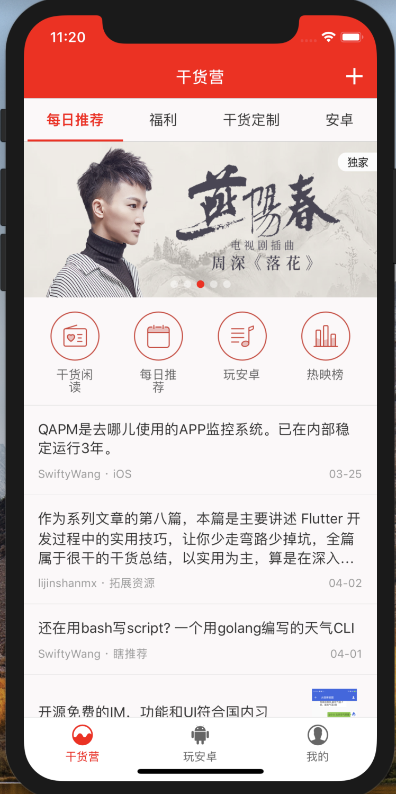
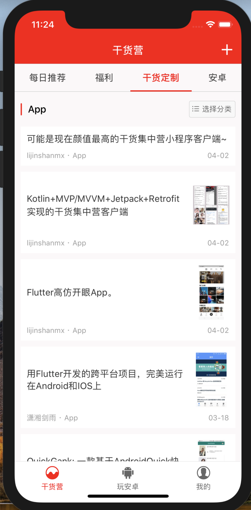
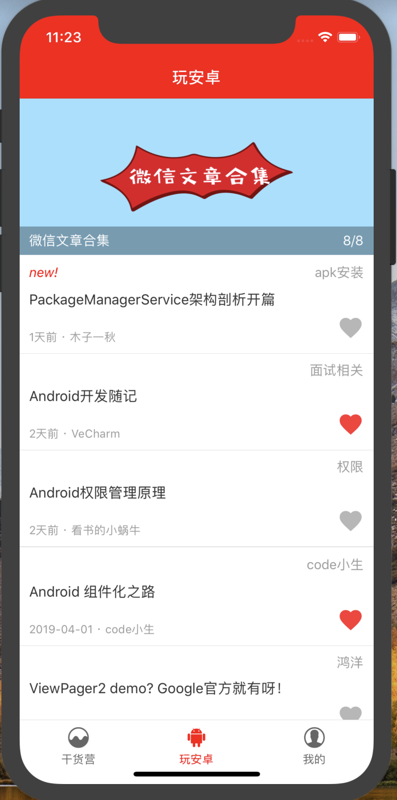
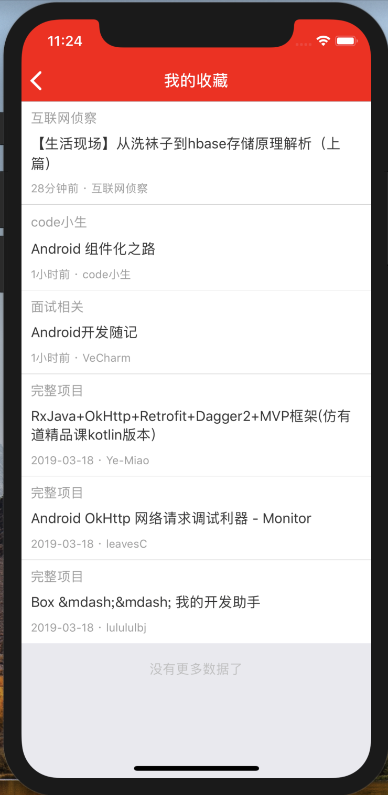
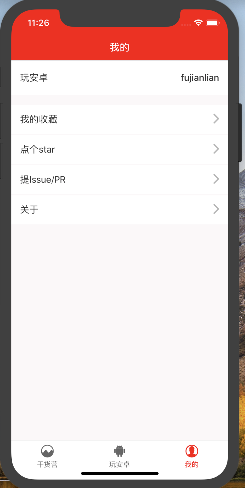

# GankRN

GankRN是[干货集中营](https://gank.io)移动端全家桶系列第二篇，根据 Gank.io 官方提供的api实现的Gank客户端，包含最新数据展示，分类列表读取，妹纸瀑布流图片，提交干货；同时接入了[@鸿洋大神](https://github.com/hongyangAndroid)的[玩Android](https://www.wanandroid.com/)网站数据，目前只接入了首页数据，登录、注册，我的收藏查看，后续版本会集成玩安卓的更多数据。

之后还会推出kotlin版本，敬请期待。

[同款flutter干货集中营](https://github.com/fujianlian/GankFlutter)

[同款Kotlin干货集中营](https://github.com/fujianlian/GankKotlin)

[同款小程序干货集中营](https://github.com/fujianlian/GankMini)

## 应用截图

 |  |  |
| :--: | :--: | :--: |
| 干货营 | 福利 | 干货定制 |

 |  |  |
| :--: | :--: | :--: |
| 玩安卓 | 我的收藏 | 我的 |

## Android app下载

 |  |
| :--: | :--: |
| 蒲公英渠道 | github渠道 |

## 版本更新日志

### V1.0.0[2019-04-04]

1、干货营数据接入

2、玩安卓首页数据接入

## 贡献

* 如果你在使用过程中遇到问题，欢迎给我提Issue

* 如果你有好的想法，欢迎pull request

* 觉得不错的话，顺手[点个Star](https://github.com/fujianlian/GankRN)，笔者需要您的支持

## 特别感谢

* api提供：[@代码家](https://github.com/daimajia)，[@鸿洋大神](https://github.com/hongyangAndroid)

* UI参考：[@youlookwhat](https://github.com/youlookwhat/CloudReader) 云阅

* [干货集中营](https://gank.io/)

* [玩安卓](https://www.wanandroid.com/)
